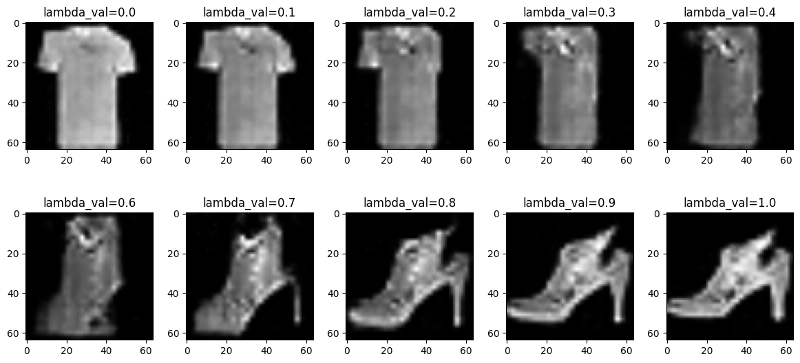

# FashionMNIST-GAN
# DCGAN on FashionMNIST

A Deep Convolutional Generative Adversarial Network (DCGAN) trained on the FashionMNIST dataset as part of a Deep Learning course assignment. The model learns to generate realistic clothing images across 10 categories.

----------------------------------------------------------------------------------------------------------------------

## Task Overview

The original notebook was provided by the course instructor, trained on the MNIST digit dataset. The task was to adapt it to train on the FashionMNIST dataset instead — keeping the architecture intact and only modifying the data loading pipeline.

----------------------------------------------------------------------------------------------------------------------

## Dataset

**FashionMNIST** by Zalando Research — 70,000 grayscale images (60,000 train / 10,000 test) across 10 clothing categories:

| Label | Class |
|-------|-------|
| 0 | T-shirt/top |
| 1 | Trouser |
| 2 | Pullover |
| 3 | Dress |
| 4 | Coat |
| 5 | Sandal |
| 6 | Shirt |
| 7 | Sneaker |
| 8 | Bag |
| 9 | Ankle boot |

Images are 28×28 grayscale, resized to 64×64 for the DCGAN architecture.

----------------------------------------------------------------------------------------------------------------------
## Model Architecture

### Generator
- Input: Random latent vector of size 100
- 5 transposed convolutional layers with BatchNorm and ReLU activations
- Output: 64×64 grayscale image with Tanh activation

### Discriminator
- Input: 64×64 grayscale image
- 5 convolutional layers with BatchNorm and LeakyReLU (slope 0.2)
- Output: Single sigmoid probability (real vs fake)

----------------------------------------------------------------------------------------------------------------------

## Training Details

| Parameter | Value |
|-----------|-------|
| Epochs | 50 |
| Batch Size | 128 |
| Latent Dimension | 100 |
| Generator LR | 0.0002 |
| Discriminator LR | 0.0001 |
| Optimizer | Adam (β1=0.5, β2=0.999) |
| Loss Function | Binary Cross Entropy |

The discriminator is trained at half the generator's learning rate to prevent mode collapse — a common instability in GAN training where the discriminator overpowers the generator early on.

-------------------------------------------------------------------------------------------------------------------------

## Changes from Original (MNIST → FashionMNIST)

- Replaced `torchvision.datasets.MNIST` with `FashionMNIST`
- Updated dataset root path to `./data/FashionMNIST`
- Added model saving after training completes
- Commented out broken pre-trained weights cell (URL no longer available)
- Fixed `to_img` function ordering issue across cells

----------------------------------------------------------------------------------------------------------------------

## How to Run

### On Kaggle (Recommended)
1. Upload `gan_fashionmnist_final.ipynb` to Kaggle
2. Go to **Settings → Accelerator → GPU T4 x2**
3. Click **Run All**
4. Training completes in ~1.5 hours

### On Google Colab
1. Upload the notebook to Colab
2. Go to **Runtime → Change Runtime Type → GPU (T4)**
3. Click **Runtime → Run All**

### Locally
```bash
pip install torch torchvision matplotlib numpy
jupyter notebook gan_fashionmnist_final.ipynb
```

----------------------------------------------------------------------------------------------------------------------

## Results

The notebook produces two outputs after training:

**1. Latent Space Interpolation** — a 2×5 grid showing smooth transitions between two randomly sampled clothing items in latent space.

**2. Generated image Grid** — a 10×10 grid of clothing images generated entirely by the trained generator from random noise.

----------------------------------------------------------------------------------------------------------------------

## Project Structure

```
├── gan_fashionmnist_final.ipynb   # Main notebook
├── pretrained/
│   ├── my_dcgan_fashionmnist.pth              # Saved generator weights
│   └── my_dcgan_discriminator_fashionmnist.pth # Saved discriminator weights
└── README.md
```

----------------------------------------------------------------------------------------------------------------------

## References

- [Original DCGAN Paper — Radford et al. 2015](https://arxiv.org/abs/1511.06434)
- [FashionMNIST Dataset](https://github.com/zalandoresearch/fashion-mnist)
- [Checkerboard Artifacts in Deconvolutions](https://distill.pub/2016/deconv-checkerboard/)

----------------------------------------------------------------------------------------------------------------------

## Tools & Environment

- Python 3.12
- PyTorch
- torchvision
- Kaggle Notebooks (GPU T4 x2)

----------------------------------------------------------------------------------------------------------------------

## Results

**Latent Space Interpolation**

**Generated Clothing Images (50 epochs)**


